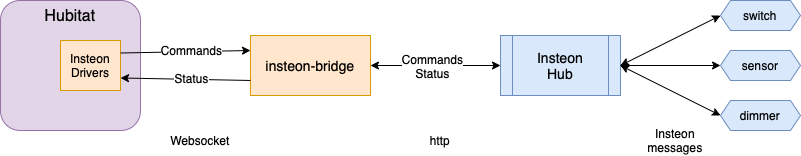

# hubitat-insteon
Hubitat driver and bridge server to integrate Insteon devices.

This project is for integrating Insteon devices into Hubitat so they can be used like any other device. Thre is no cloud or connection to Insteon needed, everything is done through an Insteon bridge server running locally that translates the Insteon hub protocol into a websocket that can accept commands and asynchronously send real time status to Hubitat.

The insteon-bridge is a node.js application that can be installed and run natively (in a VM, on a Raspberry Pi, etc) or in a premade docker container (on your NAS, rPi, etc).

## Quick Start
1. Create a config.json file from the example.
1. Start the container image, mapping the config file into it and exposing a host port to container port 8080.
1. Install the drivers on your Hubitat hub.
1. Create a new Insteon Parent device and configure it with the IP/port of the system running the bridge container.

## Device Support
* On/Off switches and plug in modules
    * Micro on/off and outlets probably work but untested.
* Dimmer switches and plug in modules
    * Micro dimmer and outlets probably work but untested.
    * Smart bulbs probably work but untested
* Contact sensors (untested)
* Motion sensors (untested)
* Leak sensors (untested)

I only own Insteon switches and dimmers so I am unable to test with other devices. Insteon devices all behave similarly, so there is code to support other devices that should work but may have some bugs.

## Acknowledgements
This project was inspired by the great work of `logname` and `cwwilson08` in [Insteon-Hubitat](https://github.com/logname/Insteon-Hubitat) and [insteon-server](https://github.com/logname/insteon-server). I was having some issues getting it to work in my environment, I wanted some missing features, and I was looking for a project to help me understand more about Hubitat, so I decided to write my own integration.
